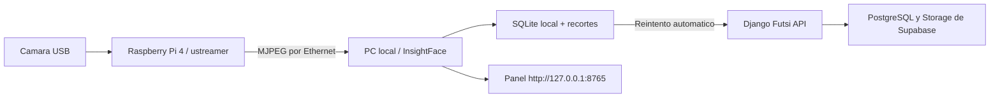

# Futsi Face Station

Estacion local para detectar y reconocer rostros en una cancha, consolidar una
asistencia por persona y sesion, y sincronizarla con Futsi cuando haya internet.
La Raspberry Pi solo transmite video; InsightFace y los datos temporales viven en
la PC de la sede.

## Flujo



Un rostro registrado genera como maximo una asistencia por persona, fecha y
sesion. Las detecciones posteriores solo incrementan el contador local. Un rostro
desconocido recibe un nombre temporal, por ejemplo `Desconocido 4359`, y permanece
en la PC hasta que un operador confirma a quien pertenece. Solo entonces se envia
el consolidado al backend.

## Requisitos

- Windows 10/11 de 64 bits en la PC de procesamiento.
- Python 3.10, 3.11 o 3.12; el instalador puede obtener Python 3.11 con `winget`.
- Ethernet entre Raspberry y PC recomendado.
- NVIDIA compatible con CUDA para modo GPU; CPU tambien funciona con menos FPS.
- Una estacion aprovisionada en Django.

## Preparar el backend

Despliega primero las migraciones y despues genera el token limitado a una sede:

```powershell
cd back
.\.venv\Scripts\python.exe manage.py migrate
.\.venv\Scripts\python.exe manage.py provision_face_station `
  --site roma `
  --name "Cancha Roma 1" `
  --camera-id cancha_1 `
  --json
```

El token solo se muestra al crearlo o rotarlo. No es una llave de Supabase: la
estacion se comunica con Django mediante `X-Futsi-Station-Key`, y Django aplica el
alcance de sede y las reglas de asistencia.

Endpoints del backend:

- `GET /api/face-station/bootstrap/`: padron, referencias y sesiones de la sede.
- `POST /api/face-station/heartbeat/`: salud de la estacion.
- `POST /api/face-station/events/batch/`: asistencias identificadas e idempotentes.
- `POST /api/face-station/unknowns/register/`: alta tras confirmar identidad.

## Instalar en Windows

1. Descarga o clona el repositorio en la PC de la cancha.
2. Ejecuta `face_station\windows\install.bat`.
3. Acepta el aviso de licencia del modelo.
4. Elige URL de Django, URL MJPEG de la Raspberry y pega el token de estacion.

El instalador:

- copia la aplicacion a `C:\Program Files\FutsiFaceStation`;
- crea un entorno Python aislado;
- instala ONNX Runtime para GPU o CPU;
- guarda configuracion y SQLite en `C:\ProgramData\FutsiFaceStation`;
- registra una tarea de Windows que inicia al arrancar y se reinicia si falla;
- abre el panel local al iniciar sesion.

Panel: `http://127.0.0.1:8765`

Diagnostico:

```powershell
powershell -ExecutionPolicy Bypass -File face_station\windows\diagnose.ps1
```

Desinstalacion, conservando evidencia local:

```powershell
powershell -ExecutionPolicy Bypass -File face_station\windows\uninstall.ps1
```

Agrega `-DeleteLocalData` solo si tambien se debe borrar SQLite, configuracion y
recortes.

## Raspberry Pi

Con la camara visible como `/dev/video0`:

```bash
cd face_station/raspberry
sudo bash install-camera-stream.sh /dev/video0 8080
```

Configura en la PC la URL que imprime el script, normalmente:

```text
http://IP_LOCAL_DE_LA_RASPBERRY:8080/stream
```

La Pi registra `futsi-camera.service` para iniciar y recuperarse automaticamente.

## Desarrollo local

```powershell
python -m venv face_station\.venv
.\face_station\.venv\Scripts\python.exe -m pip install -r face_station\requirements-cpu.txt
.\face_station\.venv\Scripts\python.exe -m face_station.app.main --synthetic
```

Para una camara USB conectada directamente a la PC, usa `0` como `camera_url`.
Para la Raspberry usa su URL MJPEG. La fuente `synthetic://diagnostic` permite
probar instalacion y panel sin una camara.

Pruebas:

```powershell
.\face_station\.venv\Scripts\python.exe -m pip install -r face_station\requirements-test.txt
.\face_station\.venv\Scripts\python.exe -m pytest face_station\tests -q
```

## Rendimiento

Con `FPS objetivo = 0`, la primera ejecucion mide el equipo y elige una frecuencia
con margen para no acumular cuadros. El bucle conserva solo el frame mas reciente,
por lo que una PC lenta reduce FPS en lugar de generar retraso creciente. El panel
permite repetir el benchmark y elegir `Automatico`, `GPU NVIDIA` o `CPU`.

La resolucion del detector y el ancho de procesamiento afectan precision y costo.
Calibra los umbrales con fotos reales de la cancha antes de automatizar decisiones.

## Offline, seguridad y privacidad

- SQLite usa WAL y una cola durable; al volver internet se reintenta el envio.
- El servidor local escucha solo en `127.0.0.1`.
- El token queda protegido por permisos NTFS y nunca contiene credenciales de
  Supabase.
- Una deteccion sin sesion valida se conserva, pero no fabrica una asistencia.
- La API valida que la persona y la sesion pertenezcan a la sede del dispositivo.
- Los recortes y logs se guardan en `C:\ProgramData\FutsiFaceStation`.

Antes de operar con menores se deben definir aviso de privacidad, consentimiento,
retencion, acceso a evidencia, procedimiento de borrado y revision humana de
coincidencias dudosas.

## Licencia del modelo

El codigo de InsightFace es MIT, pero los pesos preentrenados como `buffalo_l` no
incluyen autorizacion comercial automatica. Revisa [MODEL_LICENSE.md](MODEL_LICENSE.md)
y consigue una licencia apropiada o usa pesos propios/licenciados antes de operar
comercialmente. El instalador no redistribuye los pesos; InsightFace los obtiene en
la primera ejecucion.

## Diagnostico rapido

- Panel no abre: ejecuta `diagnose.ps1` y revisa
  `C:\ProgramData\FutsiFaceStation\logs\face-station.log`.
- Video ausente: abre directamente la URL `/stream` de la Raspberry.
- GPU no aparece: `diagnose.ps1` debe listar `CUDAExecutionProvider`.
- Sin internet: el panel muestra `OFFLINE`; las detecciones deben continuar y la
  cola pendiente debe crecer.
- Rostro no coincide: revisa calidad de referencia, luz, tamano facial y umbrales.
