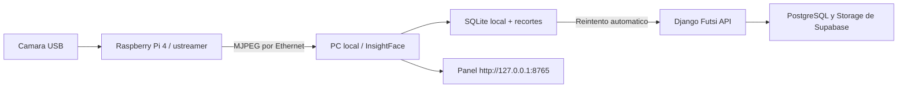

# Futsi Face Station

La interfaz de la estación está implementada en React 19 + TypeScript + Vite y comparte el stack del frontend principal. El código fuente vive en `front/src/features/face-station` y FastAPI sirve el build generado desde `face_station/app/static-react`.

Para validar y generar la interfaz desde `front/`:

```powershell
npm run typecheck
npm run build:face-station
```

Estacion local para detectar y reconocer rostros en una cancha, consolidar una
asistencia por persona y sesion, y sincronizarla con Futsi cuando haya internet.
La Raspberry Pi solo transmite video; InsightFace y los datos temporales viven en
la PC de la sede.

## Flujo


```mermaid
flowchart LR
  CAM["Camara USB"] --> PI["Raspberry Pi 4 / ustreamer"]
  PI -->|"MJPEG por Ethernet"| PC["PC local / InsightFace"]
  PC --> DB["SQLite local + recortes"]
  PC --> UI["Panel http://127.0.0.1:8765"]
  DB -->|"Reintento automatico"| API["Django Futsi API"]
  API --> SB["PostgreSQL y Storage de Supabase"]
```

Un rostro registrado genera como maximo una asistencia por persona, fecha y
sesion. Las detecciones posteriores solo incrementan el contador local. Un rostro
desconocido recibe un nombre temporal, por ejemplo `Desconocido 4359`, solamente
cuando un recorte frontal supera el filtro de calidad. Los recortes borrosos,
incompletos o con una coincidencia ambigua no pueden crear ni mejorar referencias.
Si uno de esos recortes coincide de forma valida con una identidad ya consolidada,
si registra su asistencia y queda guardado solo como evidencia rechazada; si no hay
una identidad confiable, permanece como `Sin asignar`.

## Requisitos

- Windows 10/11 de 64 bits en la PC de procesamiento.
- Python 3.10, 3.11 o 3.12; el instalador puede obtener Python 3.11 con `winget`.
- Ethernet entre Raspberry y PC recomendado.
- NVIDIA compatible con CUDA para modo GPU; CPU tambien funciona con menos FPS.
- Una estacion aprovisionada en Django.

## Preparar el backend

Despliega primero las migraciones y despues genera el token limitado a una sede:

```powershell
cd back
.\.venv\Scripts\python.exe manage.py migrate
.\.venv\Scripts\python.exe manage.py provision_face_station `
  --site roma `
  --name "Cancha Roma 1" `
  --camera-id cancha_1 `
  --json
```

El token solo se muestra al crearlo o rotarlo. No es una llave de Supabase: la
estacion se comunica con Django mediante `X-Futsi-Station-Key`, y Django aplica el
alcance de sede y las reglas de asistencia.

Endpoints del backend:

- `GET /api/face-station/bootstrap/`: padron, referencias y sesiones de la sede.
- `POST /api/face-station/heartbeat/`: salud de la estacion.
- `POST /api/face-station/events/batch/`: asistencias identificadas e idempotentes.
- `POST /api/face-station/unknowns/register/`: alta tras confirmar identidad.

Si el backend no tiene acceso directo a Storage privado, configura
`reference_proxy_url` con la funcion Supabase `face-station-photo`. La funcion
valida el token de estacion, limita cada consulta a la sede asignada y nunca
expone una llave privilegiada en la PC.

## Instalar en Windows

1. Descarga o clona el repositorio en la PC de la cancha.
2. Ejecuta `face_station\windows\install.bat`.
3. Acepta el aviso de licencia del modelo.
4. Elige URL de Django, URL MJPEG de la Raspberry y pega el token de estacion.

El instalador:

- copia la aplicacion a `C:\Program Files\FutsiFaceStation`;
- crea un entorno Python aislado;
- instala ONNX Runtime para GPU o CPU;
- guarda configuracion y SQLite en `C:\ProgramData\FutsiFaceStation`;
- registra una tarea de Windows que inicia al arrancar y se reinicia si falla;
- abre el panel local al iniciar sesion.

Panel: `http://127.0.0.1:8765`

Diagnostico:

```powershell
powershell -ExecutionPolicy Bypass -File face_station\windows\diagnose.ps1
```

Desinstalacion, conservando evidencia local:

```powershell
powershell -ExecutionPolicy Bypass -File face_station\windows\uninstall.ps1
```

Agrega `-DeleteLocalData` solo si tambien se debe borrar SQLite, configuracion y
recortes.

## Raspberry Pi

Con la camara visible como `/dev/video0`:

```bash
cd face_station/raspberry
sudo bash install-camera-stream.sh /dev/video0 8080
```

Configura en la PC la URL que imprime el script, normalmente:

```text
http://IP_LOCAL_DE_LA_RASPBERRY:8080/stream
```

La Pi registra `futsi-camera.service` para iniciar y recuperarse automaticamente.

## Desarrollo local

```powershell
python -m venv face_station\.venv
.\face_station\.venv\Scripts\python.exe -m pip install -r face_station\requirements-cpu.txt
.\face_station\.venv\Scripts\python.exe -m face_station.app.main --synthetic
```

Para una camara USB conectada directamente a la PC, usa `0` como `camera_url`.
Para la Raspberry usa su URL MJPEG. La fuente `synthetic://diagnostic` permite
probar instalacion y panel sin una camara.

El panel tambien admite una segunda camara RTSP en paralelo. Para Dahua usa una
URL sin credenciales como
`rtsp://IP:554/cam/realmonitor?channel=1&subtype=1` y captura usuario y contrasena
en sus campos separados. La API local nunca devuelve la contrasena y los errores
de video eliminan las credenciales antes de registrarse.

Pruebas:

```powershell
.\face_station\.venv\Scripts\python.exe -m pip install -r face_station\requirements-test.txt
.\face_station\.venv\Scripts\python.exe -m pytest face_station\tests -q
```

## Rendimiento

Con `FPS objetivo = 0`, la primera ejecucion mide el equipo y elige una frecuencia
con margen para no acumular cuadros. El bucle conserva solo el frame mas reciente,
por lo que una PC lenta reduce FPS en lugar de generar retraso creciente. El panel
permite repetir el benchmark y elegir `Automatico`, `GPU NVIDIA` o `CPU`.

La resolucion del detector y el ancho de procesamiento afectan precision y costo.
Calibra los umbrales con fotos reales de la cancha antes de automatizar decisiones.

## Offline, seguridad y privacidad

- SQLite usa WAL y una cola durable; al volver internet se reintenta el envio.
- El servidor local escucha solo en `127.0.0.1`.
- El token queda protegido por permisos NTFS y nunca contiene credenciales de
  Supabase.
- Una deteccion sin sesion valida se conserva, pero no fabrica una asistencia.
- La API valida que la persona y la sesion pertenezcan a la sede del dispositivo.
- Los recortes y logs se guardan en `C:\ProgramData\FutsiFaceStation`.
- Los recortes usan una carpeta plana por fecha y tipo:
  `faces\AAAA-MM-DD\{known|unknown}\<identidad>_<timestamp>.jpg`. La identidad
  y la mejor evidencia siguen indexadas en SQLite; no se crea una carpeta por
  cada rostro.
- El panel agrupa las detecciones por identidad local. Cada tarjeta conserva el
  conteo completo, pero muestra hasta 30 evidencias representativas por persona
  y dia, escogidas por calidad, camara, horario y diversidad facial.
- Tanto personas registradas como desconocidos consolidados usan hasta 12
  referencias frontales curadas. El matcher compara contra la galeria completa
  y calcula el margen contra otra identidad, no contra otra foto de la misma
  persona. Un recorte nuevo solo entra si pasa calidad y una coincidencia
  estricta; una referencia mejor puede reemplazar otra redundante o debil.
- La admision de referencias y el pase de lista son decisiones independientes:
  la calidad visual nunca anula una coincidencia que el matcher facial ya acepto,
  pero un recorte rechazado no contamina centroides ni galerias. El filtro
  semantico opcional (`semantic_reference_filter_enabled`) agrega visibilidad de
  ambos ojos, apertura ocular, region oral y oclusion por gorra; el peso ONNX se
  configura por separado mediante `semantic_reference_model_path`.
- Al terminar el lote nocturno, un reconciliador global compara galerias completas
  y une solamente grupos con evidencia reciproca y enlace completo. Antes de cada
  fusion SQLite crea un respaldo y valida integridad y llaves foraneas.
- `GET /api/unknowns/reconcile` expone el plan explicable en modo lectura. La
  aplicacion del plan requiere que la deteccion este pausada.
- Todos los JPEG nuevos permanecen completos al menos 7 dias para auditoria.
  Despues, solo los redundantes no protegidos pasan a cuarentena reversible:
  primero se crea respaldo SQLite y manifiesto, se mueven archivos en el mismo
  volumen y se revalidan referencias; la purga fisica ocurre 24 horas despues.
  Referencias permanentes, mejores recortes, asistencias, conteos historicos,
  cola de sincronizacion y recortes sin asignar nunca entran en este proceso.

Antes de operar con menores se deben definir aviso de privacidad, consentimiento,
retencion, acceso a evidencia, procedimiento de borrado y revision humana de
coincidencias dudosas.

## Licencia del modelo

El codigo de InsightFace es MIT, pero los pesos preentrenados como `buffalo_l` no
incluyen autorizacion comercial automatica. Revisa [MODEL_LICENSE.md](MODEL_LICENSE.md)
y consigue una licencia apropiada o usa pesos propios/licenciados antes de operar
comercialmente. El instalador no redistribuye los pesos; InsightFace los obtiene en
la primera ejecucion.

El filtro semantico tampoco redistribuye pesos. El modelo usado durante la
calibracion experimental se entreno con CelebAMask-HQ y no debe activarse para uso
comercial sin confirmar una licencia compatible; en produccion configura un peso
propio o debidamente licenciado.

## Diagnostico rapido

- Panel no abre: ejecuta `diagnose.ps1` y revisa
  `C:\ProgramData\FutsiFaceStation\logs\face-station.log`.
- Video ausente: abre directamente la URL `/stream` de la Raspberry.
- GPU no aparece: `diagnose.ps1` debe listar `CUDAExecutionProvider`.
- Sin internet: el panel muestra `OFFLINE`; las detecciones deben continuar y la
  cola pendiente debe crecer.
- Rostro no coincide: revisa calidad de referencia, luz, tamano facial y umbrales.
